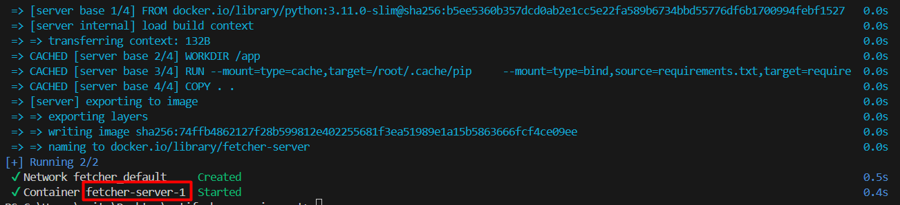

# Web Pages Fetcher

This script fetches and stores webpages and their metadata.

## Setup

**Note: All commands in the setup section must run from the root dir of this repo's clone**

First, you must build and run the docker container where you can run the script:

`docker compose up --build -d`

Make sure to take note of the container's name (it should be fetcher-server-1 but your case may vary):

Then, enter the running container using this command:

`docker exec -it fetcher-server-1 /bin/bash`

You can now use the ./fetch.py script inside the container!

You can exit the container using the `exit` command. When you're done with the container you can remove it using this command:

`docker compose down`

## Usage

You can run fetch.py by providing one or more urls:

`./fetch.py https://www.google.com/ https://www.ynet.co.il`

If it manages to access all urls, it will store the webpage of each url in the current directory, along with metadata about the urls.

To display the metadata about webpages that were already stored, you can add the `--metadata` flag to the command (this will not store webpages, only display metadata about previously stored webpages):

`./fetch.py --metadata https://www.google.com`

The metadata is stored in the metadata.json file in your current directory. If you want to choose a different filepath for the metadata storage, you can provide it with `--metadata_filepath`

`./fetch.py --metadata_filepath my_metadata.json https://www.google.com`

## Future work

There are a number of possible improvements for this code:

### Store assets

Currently the code only stores the HTML code of the webpages. Most webpages use assets (images, scripts, etc.) which are different files with different urls. We can store these assets as well so that when we open the HTML files stored locally they will also display these assets by using BeautifulSoup like this

`soup.find_all(lambda tag: tag.has_attr('src'))`

to find all tags that have a `src` attribute and then extracting the value of the `src` attribute in order to get the asset's url and download it. This will require some specified attention as some urls are relative to the webpage's domain, some are images (so the url will return a byte array) and some are scripts (so the url will return regular text).

### Bind mount for webpage file storage on the host machine

When using the docker container, the webpages and metadata are stored on the container and will be deleted when the container is taken down.  
The `docker init` command which was used to create the base files for this project provided a bind to mount for caching the pip install results. We also need to add an option to mount of file location on the host machine in order to store the webpages and metadata on the host machine, and that way when we take down the container the results will be kept for the next time we bring up a new container for this application.

### Locking mechanism for medata file

Currently it is assumed that the script will be used by one process and that multiple processes of the script will not run in parallel. To support parallel execution of the script, we will need to add a locking mechanism so that only one process can read or write from the metadata file at any given time. Because different processes can use different metadata files by utilizing the `--metadata_filepath` flag, we will need to create the locking mechanism specific to each metadata file.
